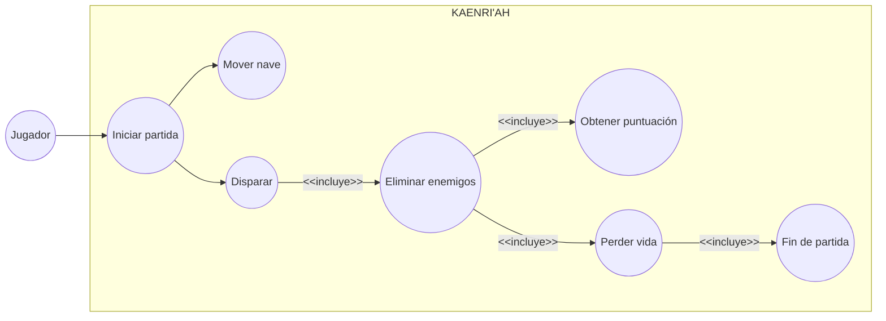

```mermaid
graph LR

jugador((Jugador))

subgraph Sistema["KAENRI'AH"]

iniciar((Iniciar partida))
mover((Mover nave))
disparar((Disparar))
destruir((Eliminar enemigos))
puntos((Obtener puntuación))
vidas((Perder vida))
final((Fin de partida))

end

jugador --> iniciar

iniciar --> mover
iniciar --> disparar

disparar --> |&lt;&lt;incluye&gt;&gt;| destruir
destruir --> |&lt;&lt;incluye&gt;&gt;| puntos

destruir --> |&lt;&lt;incluye&gt;&gt;| vidas
vidas --> |&lt;&lt;incluye&gt;&gt;| final

```
