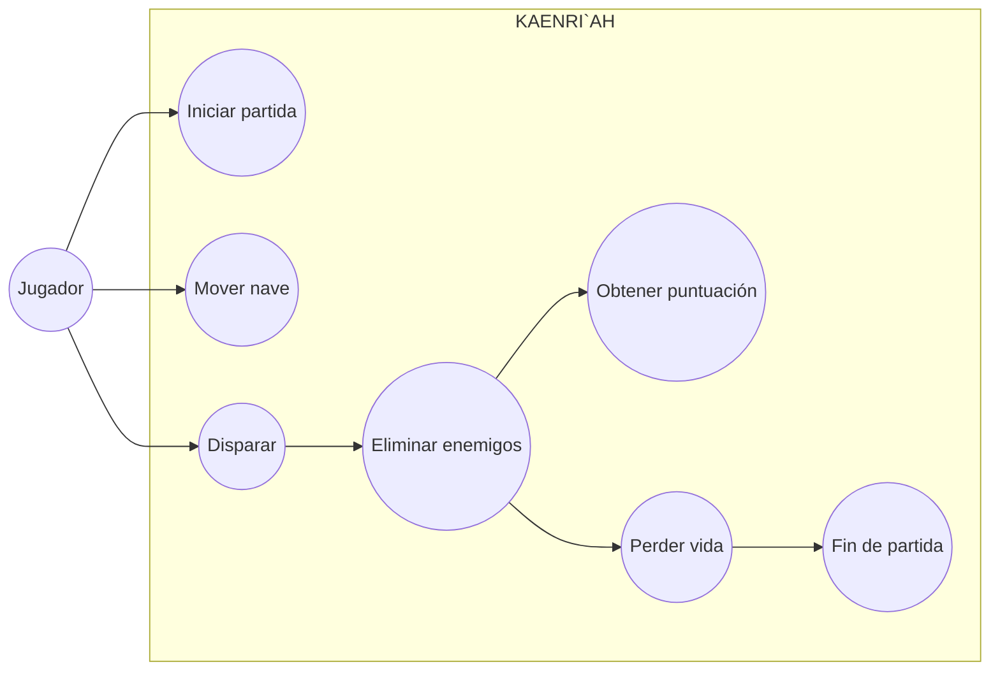

```mermaid
graph LR

actor((Jugador))

subgraph Sistema["KAENRI`AH"]

iniciar((Iniciar partida))
mover((Mover nave))
disparar((Disparar))
destruir((Eliminar enemigos))
puntos((Obtener puntuación))
vidas((Perder vida))
final((Fin de partida))
end

actor --> iniciar
actor --> mover
actor --> disparar

disparar --> destruir
destruir --> puntos
destruir --> vidas
vidas --> final

```
