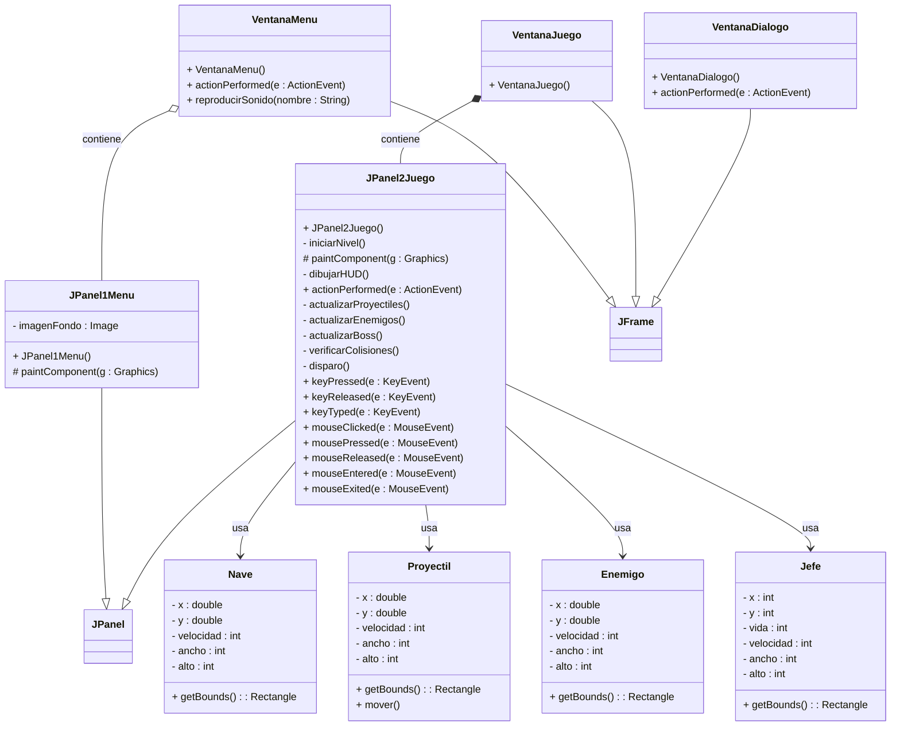

```mermaid

classDiagram

JPanel1Menu --|> JPanel
JPanel2Juego --|> JPanel
VentanaMenu --|> JFrame
VentanaJuego --|> JFrame
VentanaDialogo --|> JFrame

%%Aquí lo que se utiliza es para agregación o composición
VentanaMenu o-- JPanel1Menu : contiene
VentanaJuego *-- JPanel2Juego : contiene

%%Aquí se asocia el juego con lo que hay dentro%%
JPanel2Juego --> Nave : usa
JPanel2Juego --> Proyectil : usa
JPanel2Juego --> Enemigo : usa
JPanel2Juego --> Jefe : usa

%%Declaración de Clases con sus métodos
class JPanel1Menu{
- imagenFondo : Image
+ JPanel1Menu()
# paintComponent(g : Graphics)
}

class JPanel2Juego{
+ JPanel2Juego()
- iniciarNivel()
# paintComponent(g : Graphics)
- dibujarHUD()
+ actionPerformed(e : ActionEvent)
- actualizarProyectiles()
- actualizarEnemigos()
- actualizarBoss()
- verificarColisiones()
- disparo()
+ keyPressed(e : KeyEvent)
+ keyReleased(e : KeyEvent)
+ keyTyped(e : KeyEvent)
+ mouseClicked(e : MouseEvent)
+ mousePressed(e : MouseEvent)
+ mouseReleased(e : MouseEvent)
+ mouseEntered(e : MouseEvent)
+ mouseExited(e : MouseEvent)
}

class VentanaMenu{
+ VentanaMenu()
+ actionPerformed(e : ActionEvent)
+ reproducirSonido(nombre : String)
}

class VentanaJuego{
+ VentanaJuego()
}

class VentanaDialogo{
+ VentanaDialogo()
+ actionPerformed(e : ActionEvent)
}

class Nave{
- x : double
- y : double
- velocidad : int
- ancho : int
- alto : int
+ getBounds() : Rectangle
}

class Proyectil{
- x : double
- y : double
- velocidad : int
- ancho : int
- alto : int
+ getBounds() : Rectangle
+ mover()
}

class Enemigo{
- x : double
- y : double
- velocidad : int
- ancho : int
- alto : int
+ getBounds() : Rectangle
}

class Jefe{
- x : int
- y : int
- vida : int
- velocidad : int
- ancho : int
- alto : int
+ getBounds() : Rectangle
}

```
