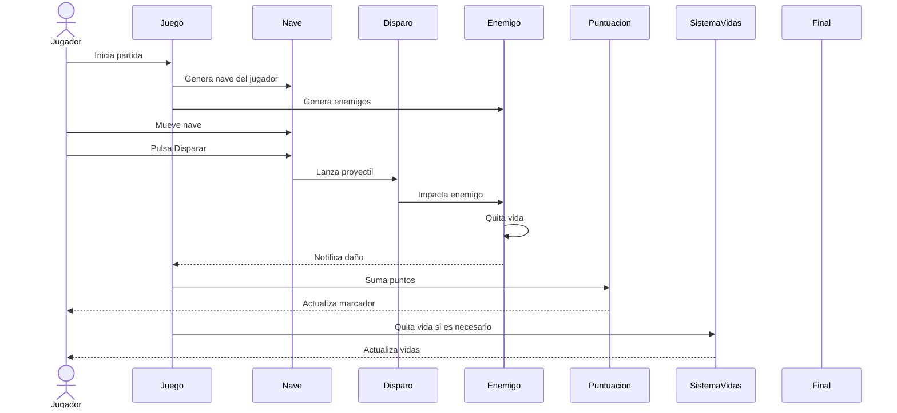

```mermaid

sequenceDiagram

    actor Jugador
    participant Juego
    participant Nave
    participant Disparo
    participant Enemigo
    participant Puntuacion
    participant SistemaVidas
    participant Final


    Jugador->>Juego: Inicia partida
    Juego->>Nave: Genera nave del jugador
    Juego->>Enemigo: Genera enemigos

    Jugador->>Nave: Mueve nave
    Jugador->>Nave: Pulsa Disparar
    Nave->>Disparo: Lanza proyectil
    Disparo->>Enemigo: Impacta enemigo
    Enemigo->>Enemigo: Quita vida


    Enemigo-->>Juego: Notifica daño
    Juego->>Puntuacion: Suma puntos
    Puntuacion-->>Jugador: Actualiza marcador

    Juego->>SistemaVidas: Quita vida si es necesario
    SistemaVidas-->>Jugador: Actualiza vidas

```

    SistemaVidas->>Final: Si vidas = 0
    Final-->>Jugador: Muestra Fin de partida
